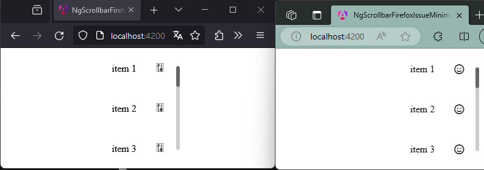
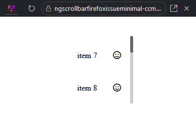

# NgScrollbarFirefoxIssueMinimal

This project was created to reproduce an issue with ngx-scrollbar and fontawesome (see [here](https://github.com/MurhafSousli/ngx-scrollbar/issues/581)). 

[Stackblitz](https://stackblitz.com/~/github.com/MarcelReichelt/ng-scrollbar-firefox-issue-minimal)

## The Issue

When opened in Firefox, the icons wont load correctly as soon as the scrollbar is displayed.

###### (Firefox to the left, Edge to the right)
 

Also the scrollbar itself seems to be broken (see Stackblitz preview): the thumb does not move.

## Dependencies

Other than Angular (17.3.0) and [ngx-scrollbar](https://github.com/MurhafSousli/ngx-scrollbar) (14.1.0) only [@fortawesome/fontawesome-free](https://www.npmjs.com/package/@fortawesome/fontawesome-free) (6.5.2) is used.

## Development server

Run `ng serve` for a dev server. Navigate to `http://localhost:4200/`. 
